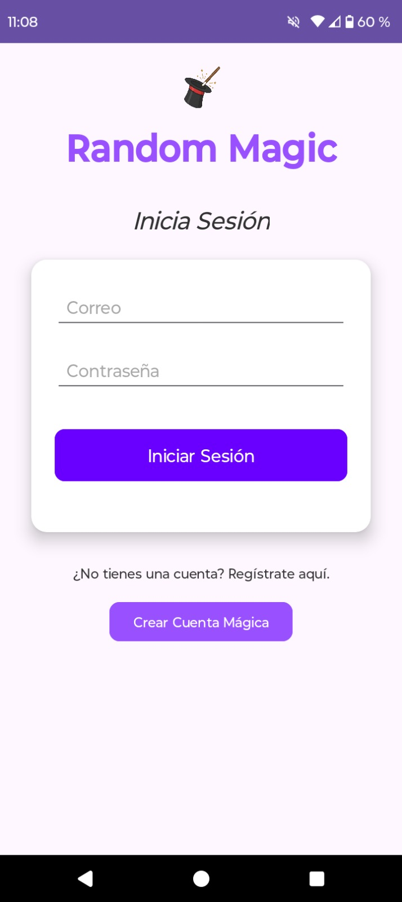
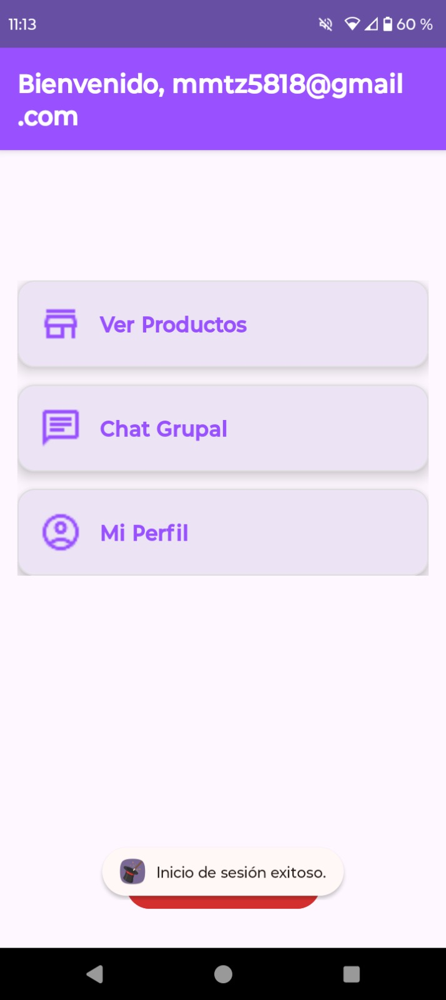
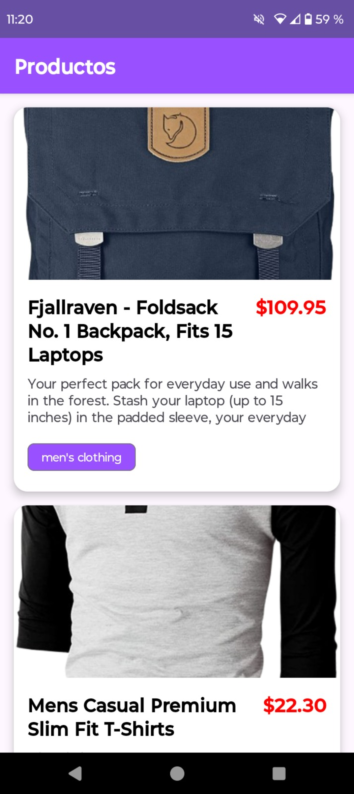
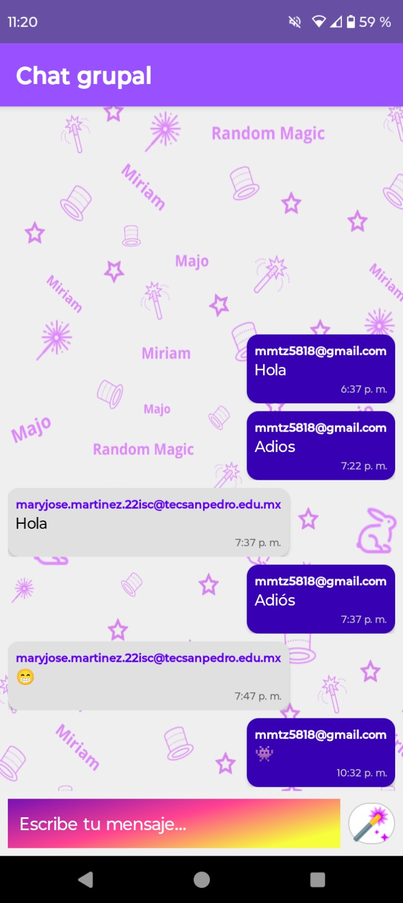

# ✨ randomMagic - App Android de Mensajería y Catálogo

**RandomMagic** es una aplicación móvil nativa desarrollada como proyecto final de la materia de Bases de Datos para Dispositivos Móviles en mi 7mo semestre de mi carrera. Combina un sistema de chat en tiempo real con un catálogo visual de productos, integrando servicios en la nube con una interfaz de usuario personalizada.

## 👥 Sinergia del Equipo
Este proyecto se estructuró separando el diseño visual de la ingeniería de software:
* **Diseño UI/UX:** Miriam Hitzel Mireles Ortiz
* **Desarrollo Android:** Maryjose Martínez Regalado

## 🛠️ Stack Tecnológico
* **Lenguaje Principal:** **Kotlin** para la lógica de negocio y control de actividades.
* **Diseño de Interfaz:** **XML** para la implementación manual de layouts para asegurar fidelidad al diseño original.
* **Backend as a Service:** **Firebase** Authentication para login seguro & Realtime Database para el chat.
* **IDE:** Android Studio.

## 👩‍💻 Mi Contribución Técnica (Full Implementation)
Como desarrolladora líder del proyecto, fui responsable de materializar el diseño y la lógica:

1.  **Implementación de UI (XML):**
    * Traduje los diseños conceptuales a código **XML** funcional, gestionando `RecyclerViews` para el chat y el catálogo de productos.
2.  **Arquitectura y Lógica (Kotlin):**
    * Programé el ciclo de vida de la aplicación y la navegación entre actividades.
    * Desarrollé la lógica de **Autenticación** (Login/Registro) conectada a Firebase.
    * Implementé la lógica de escucha en tiempo real para la mensajería instantánea.
3.  **Calidad y Pruebas:**
    * Realicé pruebas de envío/recepción de mensajes y validación de sesiones de usuario.

## 📸 Galería

